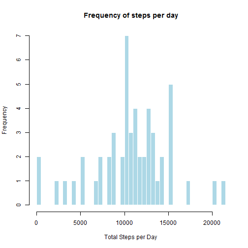
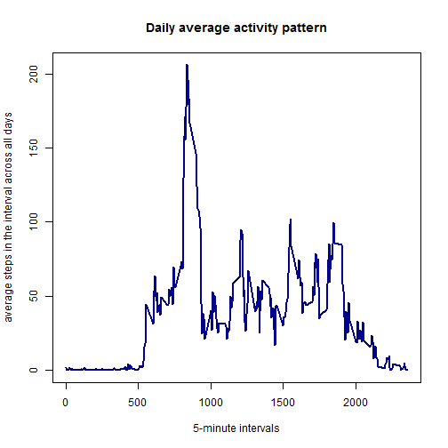
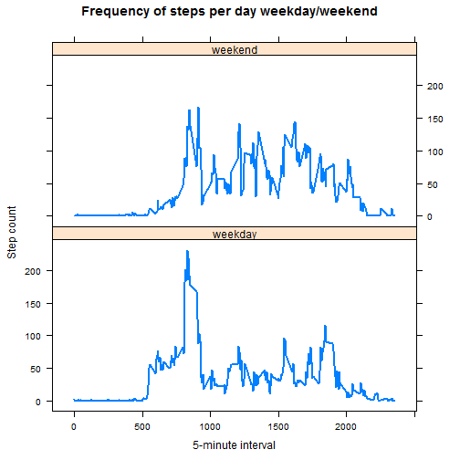

## Loading and preprocessing the data

First we need to preprocess the data and set some variables like the name of the day of the week (which is different based on language, but used later on)
* Step 0a: Define general variables like working directory. You can change this to something that suits you to test the script!
* Step 0b: Set global variables / load libraries
* Step 0c: Read and prepare the CSV as defined in step 1 


```r
## Step 0a: Define general variables like working directory. You can change this to something that suits you to test the script!
workingdir            <- "C:/Users/Jim Wittermans/Documents/GitHub/RepData_PeerAssessment1/activity/" ## Emptied for my own privacy ;-)
file_name             <- "activity.csv"
saturday              <- "zaterdag"         # Change this to your own language; warning: case sensitive!
sunday                <- "sunday"           # Change this to your own language; warning: case sensitive!

## Step 0b: Set global variables / load libraries
setwd(workingdir)
library(lattice)

## Step 0c: Read and prepare the CSV as defined in step 1 
rep_dataset            <- read.csv(file_name, head=TRUE, colClasses=c("integer", "character", "integer"), na.strings="NA")
rep_dataset$date       <- as.Date(rep_dataset$date)
rep_dataset_prepared   <- subset(rep_dataset, !is.na(rep_dataset$steps))
```


## What is mean total number of steps taken per day?
* Step 1: Get the sum per day, using tapply, but only with filled values.
* Step 2: Generate Histogram (Breaks = Length(steps_per_day) indicates how many different bars have to appear, based on the amount of different records)
* Step 3: Report the mean and median


```r
## Step 1: Get the sum per day, using tapply, but only with filled values.
steps_per_day          <- tapply(rep_dataset_prepared$steps, rep_dataset_prepared$date, sum, na.rm=TRUE, simplify=T)
steps_per_day          <- steps_per_day[!is.na(steps_per_day)]

## Step 2: Generate Histogram (Breaks = Length(steps_per_day) indicates how many different bars have to appear, based on the amount of different records)
hist(x=steps_per_day,
     ylab="Frequency",
     xlab="Total Steps per Day",
     main="Frequency of steps per day",     
     col="lightblue",
     border=0,
     breaks=length(steps_per_day))
```

 

```r
## Step 3: Report the mean and median
mean(steps_per_day)
```

```
## [1] 10766.19
```

```r
median(steps_per_day)
```

```
## [1] 10765
```


## What is the average daily activity pattern?
* Step 1: Use tapply to get the mean per interval, as defined per 5 minutes in the dataset
* Step 2: Generate the histogram with the previously generated dataframe.
* Step 3: Get the max steps per interval


```r
## Step 1: Use tapply to get the mean per interval, as defined per 5 minutes in the dataset
steps_mean             <- tapply(rep_dataset_prepared$steps, rep_dataset_prepared$interval, mean, na.rm=TRUE, simplify=T)
steps_mean_dataframe   <- data.frame(interval=as.integer(names(steps_mean)), avg=steps_mean)

## Step 2: Generate the histogram with the previously generated dataframe.
with(steps_mean_dataframe,
     plot(interval,
          avg,
          type="l",
          xlab="5-minute intervals",
          ylab="average steps in the interval across all days",
          main="Daily average activity pattern",
          col="darkblue",
          lwd="2"
          )
         )
```

 

```r
## Step 3: Get the max steps per interval
max_steps              <- max(steps_mean_dataframe$avg)
steps_mean_dataframe[steps_mean_dataframe$avg == max_steps,]
```

```
##     interval      avg
## 835      835 206.1698
```

## Imputing missing values
* Step 1: Report the number of missing values
* Step 2: Handle the missing values and fill them in. We use the mean of the last interval to fill in the blanks
* Step 3: Create new dataset based on the filled missing values
* Step 4: Generate new histogram based on the filled missing values, used the same code for part 1.
* Step 5: Report the mean and median


```r
## Step 1: Report the number of missing values
sum(is.na(rep_dataset$steps))
```

```
## [1] 2304
```

```r
## Step 2: Handle the missing values and fill them in. We use the mean of the last interval to fill in the blanks
rep_dataset_copy        <- rep_dataset
dataframe_missing_values<- is.na(rep_dataset_copy$steps)
retrieve_average        <- tapply(rep_dataset_prepared$steps, rep_dataset_prepared$interval, mean, na.rm=TRUE, simplify=T)
rep_dataset_copy$steps[dataframe_missing_values]    <- retrieve_average[as.character(rep_dataset_copy$interval[dataframe_missing_values])]

## Step 3: Create new dataset based on the filled missing values
new_steps_per_day       <- tapply(rep_dataset_copy$steps, rep_dataset_copy$date, sum, na.rm=TRUE, simplify=T)

## Step 4: Generate new histogram based on the filled missing values, used the same code for part 1.
hist(x=new_steps_per_day,
     ylab="Frequency",
     xlab="Total Steps per Day",
     main="Frequency of steps per day (with filled missing values)",     
     col="lightblue",
     border=0,
     breaks=length(new_steps_per_day))
```

 

```r
## Step 5: Report the mean and median
mean(new_steps_per_day)
```

```
## [1] 10766.19
```

```r
median(new_steps_per_day)
```

```
## [1] 10766.19
```


## Are there differences in activity patterns between weekdays and weekends?

Pattern differences between weekdays and weekends, seperate steps: 
* Step 1: Function to see whether the day is a weekend day or a weekday, using the weekdays function.
* Step 2: Get the weekday column based on the previously defined function. Don't forget to define the names of the weekdays in step 0. 
* Step 3: Then add the column to the already existing dataset
* Step 4: Aggregate the data, preparing for making the new plot
* Step 5: Actually creating the new plot


```r
# Step 1: Function to see whether the day is a weekend day or a weekday, using the weekdays function.
## (is_weekday function credits: Github User from Previous Course, EDITED BY Jim Wittermans for language differences)
is_weekday <- function(d) {
  wd <- weekdays(d)
  ifelse (wd == saturday | wd == sunday, "weekend", "weekday")
}


# Step 2: Get the weekday column based on the previously defined function. Don't forget to define the names of the weekdays in step 0. 
generate_weekday_column     <- sapply(rep_dataset_copy$date, is_weekday)

# Step 3: Then add the column to the already existing dataset
rep_dataset_copy$wk         <- as.factor(generate_weekday_column)

# Step 4: Aggregate the data, preparing for making the new plot
grouped_steps_per_interval  <- aggregate(steps ~ wk+interval, data=rep_dataset_copy, FUN=mean)

# Step 5: Actually creating the new plot
xyplot(steps ~ interval | factor(wk),
       layout = c(1, 2),
       xlab="5-minute interval",
       ylab="Step count",
       main="Frequency of steps per day weekday/weekend",     
       type="l",
       lty=1,
       lwd="2",
       data=grouped_steps_per_interval)
```

 
